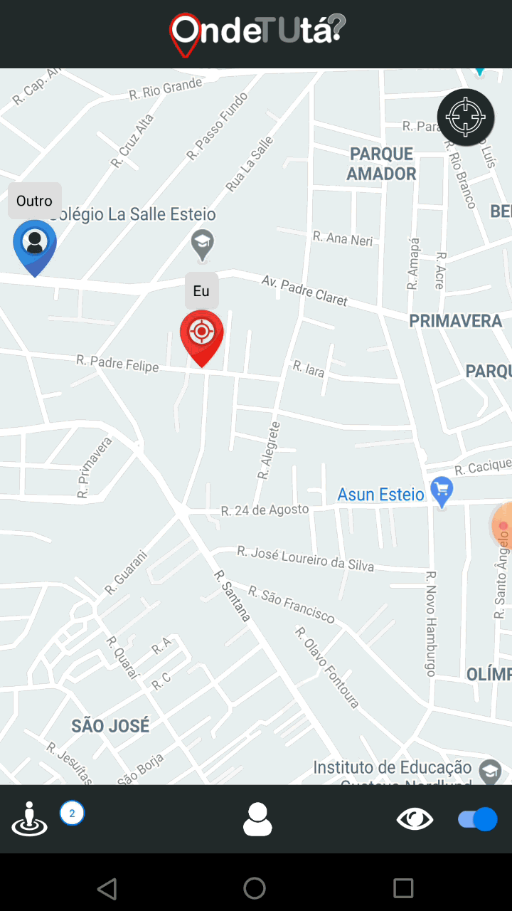

<p align="center">
    
</p>

<p align="center">
    
</p>

## Descrição
Aplicativo de rastreamento geográfico simples que renderiza vários usuários em um mapa. Os usuários poderão alternar suas permissões de localização, bem como clicar em um botão para ampliar o mapa em sua localização. Utiliza o [PubNub Presence](https://www.pubnub.com/products/presence/) para rastrear usuários estão online no aplicativo.

## Como executar o projeto
```
react-native run-android
```

## Tecnologias
- [React](https://pt-br.reactjs.org/)
- [React Native](https://reactnative.dev/)
- [AsyncStorage](https://reactnative.dev/docs/asyncstorage)
- [Geolocation](https://reactnative.dev/docs/geolocation)
- [PubNub](https://www.pubnub.com/docs/react-native-javascript/pubnub-javascript-sdk)
- [Google Maps Directions](https://www.npmjs.com/package/react-native-google-maps-directions)
- [React Native Maps](https://www.npmjs.com/package/react-native-maps)
- [React Native Responsive Screen](https://www.npmjs.com/package/react-native-responsive-screen)
